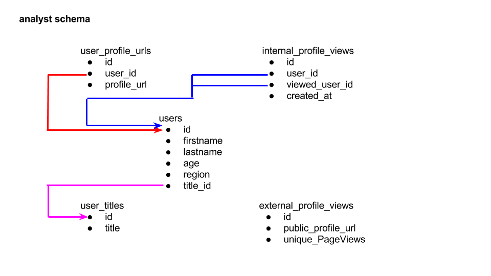

Working as the data team’s point person on this project, you are responsible for pulling together and manipulating relevant data to advise the product manager on how the data can drive this new feature forward. Central to these tasks are the tables in your company’s database that contain user information and profile view records. To help you familiarize yourself with where the data live, here's a visual and explanation of the table schema:

Briefly,

users: table containing information about the members of the academic network
user_titles: table containing job titles; foreign key in users is title_id (magenta)
user_profile_urls: tabulates user_id and its associated profile url used internally
internal_profile_views: tabulates all profile views that occurred within the social network application; logged as user_id who views the profile of viewed_user_id
external_profile_views: tabulates summary information about clicks on public_profile_urls that occur off of search engine searches
