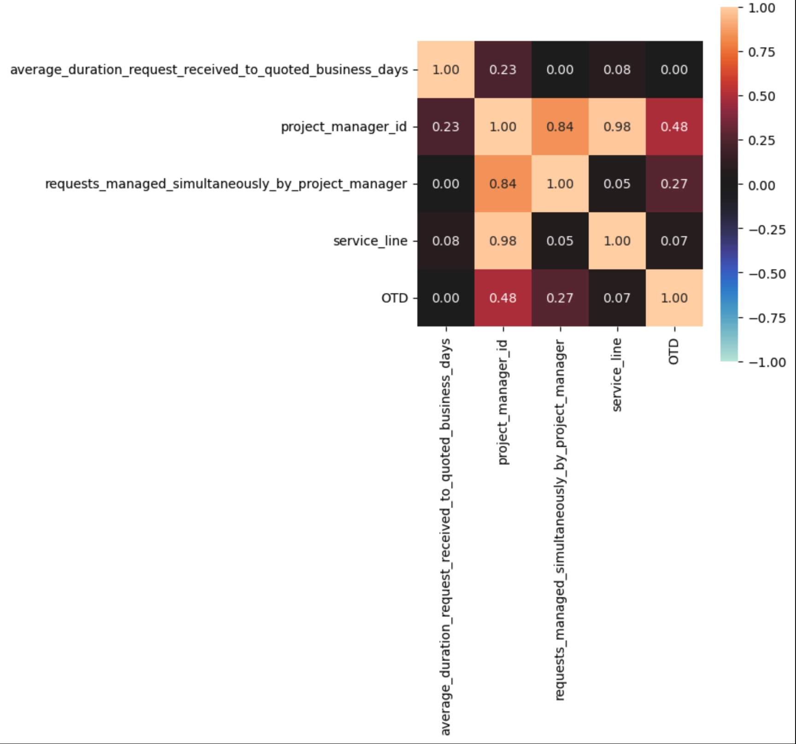
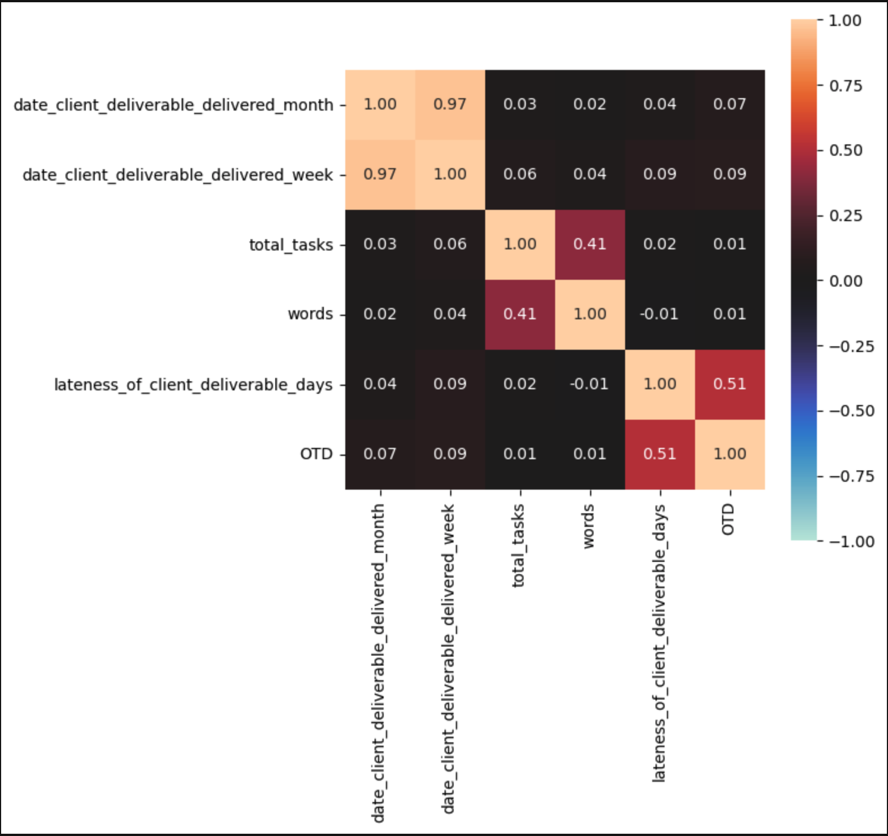

1. Describe the tools you used to generate the following results. And, as much as possible, in all subsequent exercises, be prepared to show any "code" or anything else that demonstrates how you completed the exercise.

The tools I used were:
a. My local machine to spin up PostgreSQL Database to store original data file and create transformations.
b. Kaggle notebook to create ipynb.
c. All code is in the same path as this file.

2. Develop and show at least 3 different data visualizations showing how Welocalize performed in terms of OTD rates (how frequently we deliver on time vs. late). Consider how these OTD rates are correlated with other attributes/variables from the dataset. Be prepared to explain how you calculated OTD rates; what the visuals demonstrate; and what are the most important conclusions you drew from the data.

I calculated [OTD/non-OTD rates](https://github.com/mindyng/Take-Homes/blob/master/Welocalize/Senior_Data_Analyst/data_transformations.sql#L54-L60) by doing a sum over rows that had target column as N/Y divided by total deliverables over month and week in year. 
In terms of OTD rates, for majority of 2022, the company was within customer tolerance level of 90% - 95% OTD's. 

We can see here that 90.5% are OTD's (True) and 9.5% (False) need some work. The neighboring graph just shows straight counts for reference. Even though Welocalize made the cut-off for customer acceptance, still room for improvement.

After calculating OTD %'s, I explored how these looked at the year, monthly, weekly, day in month and day in week levels. The most illuminating seemed to be monthly and weekly since they seemed to show some trends/seasonality. OTD's drop significantly every 10 weeks until appoximately 32nd week of 2022/August.

It was not suprising that total number of tasks varied much more with deliverables that had non-OTD's. What was more suprising was that when it came total words, average time it took to claim a task and average time it took to start it, these trends were more surprising. The assumption was that non-OTD's had higher amount of words and lingering time with tasks being picked up. However, this seemed to not be the case. It was the tasks that had OTD that had higher volumes of words translated and longer duration times between each process for translation task to kick-start. Please refer to OTD-Deliverables and Non-OTD Deliverables graphs.

The determining factor in what contributed most to OTD was determined by heatmaps that showed how positively or negatively two columns were related to each other. The closer to +1 the more similar they were and the closer to -1 the least similar these columns were to each other. Three heatmaps were run in order to show from requests/deliverables/task level, which columns contributed most to OTD. During some exploratory data analysis, it was found that a project manager could be managing deliverables that are turned in on time and not on time. So singling out project managers was not possible. Another interesting finding was that through crude correlation analysis with pivot tables, found that there were some strong correlations between source (tgl-PH) and target (en-SG) languages leading to non-OTD's. Of course the most illuminating contributor to deliverable having OTD was not how many words or how many tasks were in a deliverable, but the **translator/supplier** who took up the task!

3. To discuss: imagine you are contributing to an initiative to improve OTD performance at Welocalize. Brainstorm and tell us what you and the team might do, based on your insights from #2, above. What questions might you ask? Who might you involve? What are some potential actions that Welocalize might take, to improve OTD performance?

Given that it was determined that translator/linguist contributes most to whether or not the deliverable is completed on time, I would ask what is the current process for linguist to pick up a task and how they are trusted to complete the task. How are these linquists vetted? If they are newer, is there more hand-holding? Are there checkpoints during the translation process? To answer these preliminary questions, I would involve the whole team in the translation process from client to local translator to quality control, to project manager to make sure Welocalize is meeting SLA's to the highest level. Some potential actions that Welocalize can take in order to improve translators' turn-around time is by looking at the language-pair (source and target) and seeing if this is a new one, have more checkpoints in place and quality control not just at the end of the tranlation process, but also at the beginning to ensure that the source text quality is understandable. Possibly pulling in more localization experts, having a definitions guide on hand and keeping communication lines open between translator and project manager would be good starters in improving OTD's. 

4. To discuss: did you encounter any data quality issues in the dataset? If so, what were they? And how did they impact your analyses in the other exercises? What would you do about issues like these, in the "real world?"

There were a couple of data issues:
* The dataset was of mixed granularity. I ended up separating out deliverable info from requests and translation task info. Requests comprise of multiple deliverables. And deliverables have multiple tasks which can include a translation task 
* Took out NULL values from is_client_deliverable_past_due (2 rows only; low % of whole dataset)
* Transformed data into correct data given column data type (boolean -> TRUE/FALSE)
* Created consistent precision (round to nearest seconds vs having seconds to thousandth's place)
* Also, having target column as a flag defined as completing the action would be best; e.g. OTD flag with 1 being True and 0 being False vs is_client_deliverable_past_due = Y/N
* Having shorter column names and allow data dictionary to mitigate possible confusion

1. To mitigate mixed columns, separated out requests and tasks columns from deliverable columns. In "real world" there would be three different tables: requests, deliverables, tasks with their own primary ID's. Foreign keys would allow all three tables to be joined together. Would talk to Data Engineer regarding making these schemas. 
2. Making sure column data, precision and decent length column names are correct would involve discussions with Data Engineering as well in the "real world".
3. Because this was not available with sample dataset I was given, there were pre-processing steps I had to go through before analyzing the data.
